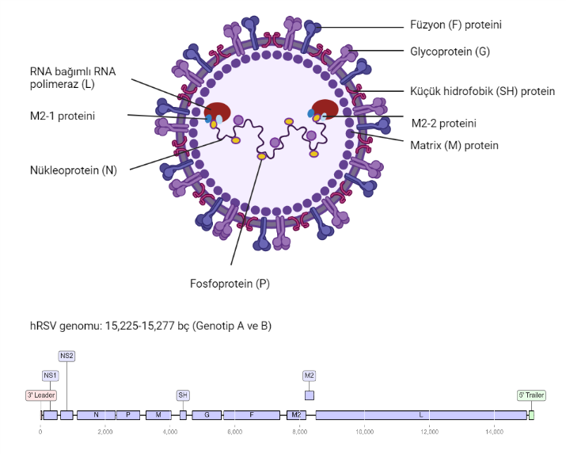
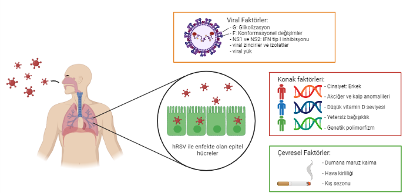

=================
Literature Review
=================

--------------------
Disease Epidemiology
--------------------
İnsan solunum sinsityal virüsü bronşit ve zatürre gibi ölümcül olabilecek hastalıklara neden olan bir virüstür. Genellikle çocuklarda ve genç yetişkinlerde görülmekle birlikte yaşlı bireylerde de görülme sıklığı gittikçe artmaktadır. Dünya genelinde etki gösteren hRSV, çocuklarda ve genç yetişkinlerde her sene ortalama 30 milyon kişinin akut solunum yolu enfeksiyonu geçirmesine neden olmaktadır. Çocuk yaşta olan hasta bireyler için ise yılda ortalama 60,000'den fazla ölüm gerçekleşmektedir [1]. Enfeksiyon sonucu oluşan morbidite ve mortalite sayıları ülkeler arasında çeşitlilik göstermektedir. Örnek olarak Brezilya'da enfekte olup çocuk servisine yatan hastaların oranı %35 [2], İtalya'da %22, Belçika'da %35 ve İngiltere'de %59 olarak görülmüştür [3].

^^^^^^^^^^^
Seasonality
^^^^^^^^^^^

İnsan solunum sinsityal virüsünün mevsimselliği çeşitli araştırmalarda ortaya çıkarılmıştır. Bu virüsün neden olduğu enfeksiyonlar yıl boyunca etkinlik göstermekle birlikte en çok kış aylarında dominant özellik göstermektedir [4]. Diğer enfeksiyonlar ise daha çok Kasım ve Aralık aylarında gerçekleşmektedir [5].

---------------------------------
Human Respiratory Syncytial Virus
---------------------------------

^^^^^^^^^^^^^^^^^^^
History of the HRSV
^^^^^^^^^^^^^^^^^^^

RSV ilk olarak 1955 yılında Walter Reed Army Araştırma Enstitüsünde (WRAIR, Washington, DC, USA) 20 şempanzede görülen öksürme, aksırma, mukopürülan akıntı ile karakterize edilmiştir [6]. Viral izolasyon karaciğer hücrelerinde gerçekleştirilerek fare, hamsters, tavşan ve şempanze gibi laboratuvar hayvanlarında inoküle edilmiş ve semptom geliştirme durumu kontrol edilmiştir. Daha sonraki çalışmalarda insanda izolasyon gerçekleştirme işlemi başarısız olmasında rağmen şempanzeden elde edilen ajana karşı kompleman fiksasyonu ile antikor titresinde bir artış tespit edilmiş ve buna bağlı olarak gençlerde ve yetişkinlerde paralel olarak yeni çalışmalar başlatılmıştır. Sonraki yıllarda Chanock ve arkadaşları tarafından gerçekleştirilen çalışmada şempanzede bulunan ajanın bir benzeri zatürre hastası bir çocuktan ve kuş palazı hastalığı olan başka bir çocuktan izole edilmiştir [7,8]. İzole edilen bu ajana ise insan solunum sinsityal virüsü (hRSV) adını vermişlerdir.

^^^^^^^^^^^^^^^^^^^^^^^^^^^^^^^^^^^^
Genome architecture and nomenclature
^^^^^^^^^^^^^^^^^^^^^^^^^^^^^^^^^^^^

İnsan solunum sinsityal virüsü (hRSV), taksanomik sınıflandırmada       Negarnaviricota şubesi, Monjiviricetes sınıfı, Mononegavirales takımı,  Pneumoviridae ailesi, Orthopneumovirus cinsi içerisinde bulunmaktadır [9,10,11]. hRSV, elektron mikroskobun da hem uzun ipliksi yapıda hemde küre şeklindeki parçacıklar halinde görülebilmektedir [12]. hRSV, non-segmented yapıda, tek zincirli ve negatif polariteli, yaklaşık 15.000 nükleotid içeren bir virüstür. Viral genomu toplamda 10 gen içerir ve bu genler 11 protein kodlamaktadırlar. Bu proteinlerin 9 tanesi yapısal, 2 tanesi (NS1-NS2) ise yapısal olmayan proteinlerdir [13]. 3'-5' yönünde RNA zincirine sahip hRSV genleri genom içersinde NS1-NS2-N-P-M-SH-G-F-M2-L şeklinde sıralanmaktadır [Şekil 1].

      
      hRSV Virion Yapısı ve Genom Kompozisyonu. Pablo F. Céspedes, Claudia A. Rivera, Rodrigo A. Díaz, Alexis M. Kalergis (2018) New Insights for the Rational Design Of Human Respiratory Syncytial Virus Vaccines: From Molecular Biology to Clinical Trials, sayfa 3 Şekil 1'den uyarlanmıştır.

^^^^^^^^^^^^^^^^^^^^^^
Classification Of HRSV
^^^^^^^^^^^^^^^^^^^^^^

^^^^^^^^^^^^^^^^^^^^^^^^^^^^^^
hRSV Pathogenesis
^^^^^^^^^^^^^^^^^^^^^^^^^^^^^^

      
      hRSV patogenezine dahil olan viral, konak ve çevresel faktörler

^^^^^^^^^^^^^^^^^^^^^^^^^^^^^^
Mechanism of viral variability
^^^^^^^^^^^^^^^^^^^^^^^^^^^^^^

^^^^^^^^^^^^^^^^^^^^^^^^^^^^^
Challenges for vaccine design
^^^^^^^^^^^^^^^^^^^^^^^^^^^^^

------------------------------------
Antigenic sequence diversity of HRSV
------------------------------------

------------------------------------------------------------------------------------
Bioinformatics approach to dissect the dynamics of HRSV antigenic sequence diversity
------------------------------------------------------------------------------------