=======
Results
=======

----
Data
----

NCBI Virus ve VIPR veritabanlarından indirilen insan solunum sinsityal virüsü protein dizilerine ait birleştirilen ve tekilleştirilen veri seti, virüsün 11 proteini için toplam 13770 kayıttan oluşmaktadır. Bu sayı, veri setinin protein dizilerine göre sınıflandırılması ve tekrar tekilleştirilmesi işleminden sonra 5766'ya düşmüştür. Virüsün her iki alt tipinin de benzer uzunlukluktaki protein dizilerine sahip olduğu görülmektedir (Şekil 1). Ayrıca, proteinlerin kendi içindeki dizi çeşitliliği de en düşük benzerlik oranına bakılarak incelenebilir. Virüsün en fazla çeşitliliğe sahip proteini en düşük benzerlik oranı %35.39 olan G proteini iken en fazla korunmuş bölge içeren proteini ise %75.54 ile L proteini olarak bulunmuştur.

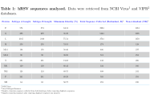
      
      İnsan solunum sinsityal virüsünün analiz edilen verileri ile ilgili bilgiler

NCBI Virus veritabanından indirilen veri seti incelendiğinde protein dizilerinin dağılımının 1956 ve 2019 yılları arasında olduğu görülmektedir. En fazla protein dizisi eklenen yıl ise 2013'tür ve eklenen protein dizisi kaydı 7328'dir (Şekil 1).

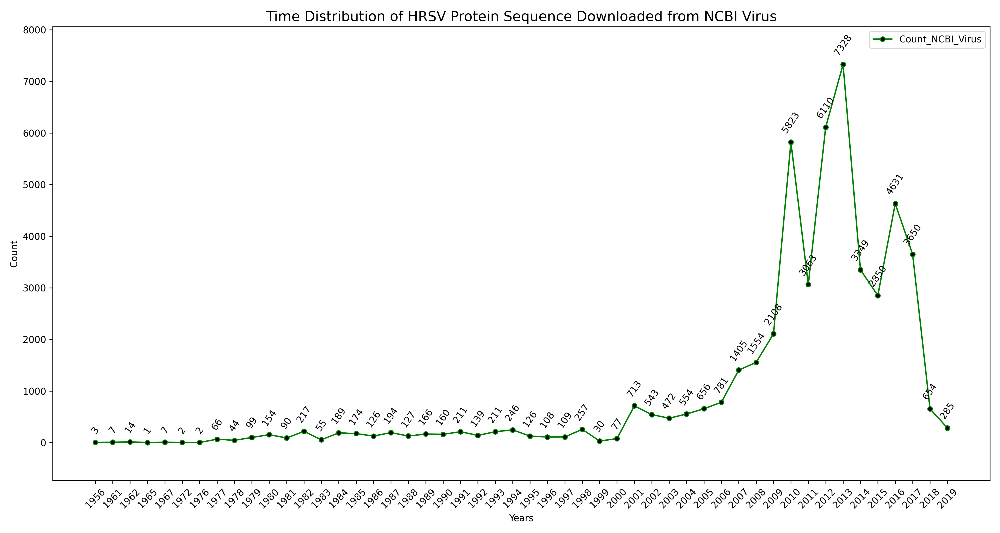
      
      NCBI Virus veritabanından indirilen veri setindeki protein dizilerinin yıllara göre dağılımı

NCBI Virus veritabanından indirilen veri setindeki protein dizileri Asya, Afrika, Avrupa, Kuzey Amerika, Güney Amerika ve Okyanusya olmak üzere 6 farklı kıtada ve 71 farklı ülkede coğrafi dağılım göstermektedir (Şekil 1). Veri setindeki en büyük yüzdeye sahip olan ülke %23 ile Amerika'dır.

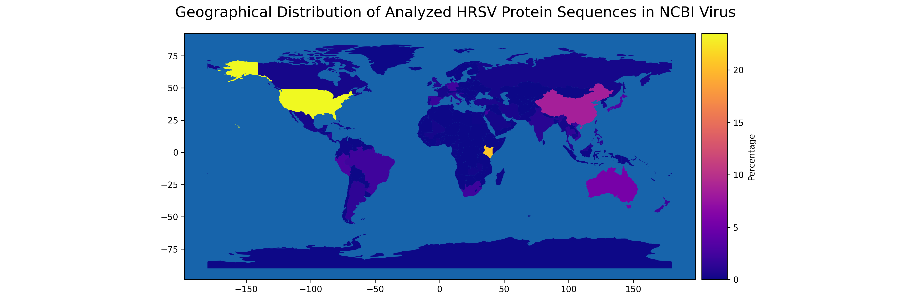
      
      NCBI Virus veritabanından indirilen veri setindeki protein dizilerinin coğrafi dağılımı

VIPR veritabanından indirilen veri seti incelendiğinde protein dizilerinin dağılımının 1956 ve 2019 yılları arasında olduğu görülmektedir. En fazla protein dizisi eklenen yıl ise 2013'tür ve eklenen protein dizisi kaydı 7102'dir (Şekil 1). Bu sayının, NCBI Virus veritabanından indirilen veri setinde farklı olması veritabanlarında bulunan protein dizileri arasında farklılık olduğuna işaret etmektedir. Çalışmanın geniş kapsamlı olması açısından farklı veritabanlarının kullanılmasının önemini de ortaya koymaktadır.

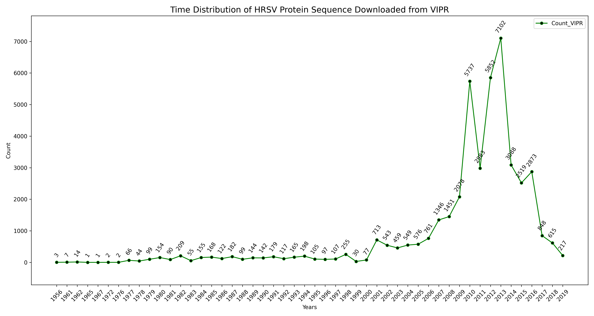
      
      VIPR veritabanından indirilen veri setindeki protein dizilerinin yıllara göre dağılımı

VIPR veritabanından indirilen veri setindeki protein dizileri NCBI Virus veritabanı ile aynı olarak Asya, Afrika, Avrupa, Kuzey Amerika, Güney Amerika ve Okyanusya olmak üzere 6 farklı kıtada ve 71 farklı ülkede coğrafi dağılım göstermektedir (Şekil 1). Veri setindeki en büyük yüzdeye sahip olan ülke %26 ile Amerika'dır. Diğer ülkelerde NCBI Virus veritabanındaki protein dizileri ile benzer yüzdelere sahiptir.

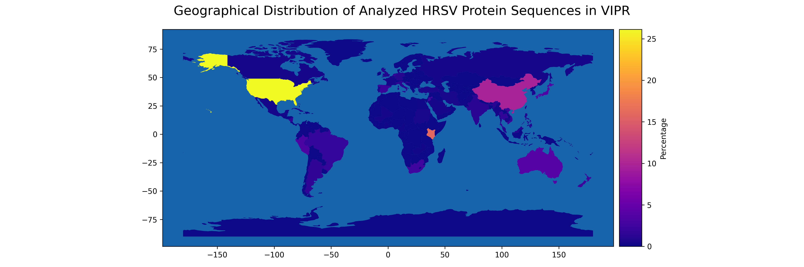
      
      VIPR veritabanından indirlen veri setindeki protein dizilerinin coğrafi dağılımı

---------------------------
Proteome Sequence Diversity
---------------------------

hRSV proteome dizi çeşitliliği Shannon entropisi kullanılarak ölçülmüştür. Proteome düzeyinde entropi değeri ortalama 0.79 olarak bulunmuştur ve entropi değeri dağılımı 0 ile 4.19 arasında değişim göstermiştir. Buna bağlı olarak, proteome düzeyinde korunmuşluk yüzdesi yüksek olarak ifade edilebilir. Proteome düzeyindeki total varyantların ortalama değeri ise %22.66'dır ve varyantların değer dağılımı %0 ile %79.33 arasında bulunmuştur. 4 proteinin (L,M,N,P) ortalama entropi değeri olan 0.79'dan düşük değere sahip olduğu gözlemlenmiştir (Tablo 1). 

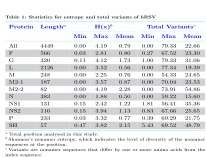
      
      hRSV proteomunun entropy değerleri ve total varyantlarının istatistiksel analizini içeren tablo

Entropi değeri 1'e eşit ve küçük olan tam 2480 pozisyon hRSV proteomunda bulunmuştur. 1612 pozisyonun entropi değeri 2'ye eşit ve küçük olmakla birlikte 1'den de büyük olarak gözlemlenmiştir. Bunun yanı sıra, entropi değeri 3'e eşit ve küçük olan 2'den de büyük olan 269 pozisyon vardır. 82 pozisyonun entropi değeri 3'den büyük, 4'e eşit ve küçüktür. Sadece 6 pozisyonun entropi değeri 4'den büyük, 5'e eşit ve küçük olarak bulunmuştur. Toplamda analiz edilen 4449 pozisyonun %55.7'sinin (entropi değeri 1'e eşit ve küçük olan pozisyonlar) yüksek korunmuşluğa sahip olduğu saptanmıştır. Proteome düzeyinde maksimum entropi değeri olan 4.19 ise M2-2 proteininde bulunmaktadır ve 43-51 pozisyonları arasındaki nonamer dizisine aittir. Total varyantların maksimum değeri olan %79.33 ise G proteininde 312-320 pozisyonları arasındaki nonamerde bulunmuştur. Bu zamana kadar yapılan çalışmalarda en yüksek entropi değerine sahip (en fazla çeşitlilik gösteren) nonamer HIV-1 B kolunda Env proteinine aittir ve değeri 9.2'dir. Aynı şekilde, en yüksek total varyantlar da HIV-1 virüsün Env proteinine ait olup değeri %98'dir. Özellikle entropi değerinde yaklaşık 2 kattan fazla bir boşluk olduğu hRSV ve HIV-1 arasında görülmektedir (Şekil 1). Bu durum, hRSV proteomunun genel olarak korunmuş bölgelerden oluştuğunu göstermektedir ve uygun aşı adayı epitoplar keşfetmenin hRSV için mümkün olduğunu ortaya koymaktadır.

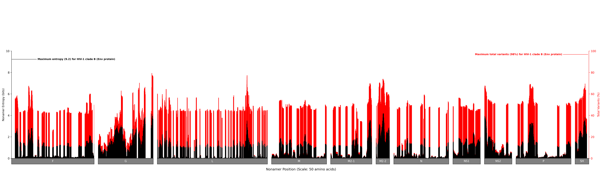
      
      hRSV proteinlerinin her pozisyonu için entropy değerlerini ve total varyantlarını gösteren grafik

hRSV proteomunda entropi ve total varyantlar arasında ilişki incelendiğinde iki değer arasında güçlü pozitif korelasyon olduğu görülmektedir (Pearson korelasyon katsayı r = 0.89). Tüm nonamer pozisyonları ele alındığında total varyantlar için entropi değeri 1, toplam nonamerlerin yaklaşık %55'inde görülmüştür. Entropi değeri 2,3,4 ve 4.19 (maksimum entropi değeri) sırasıyla tüm nonamerlerin yaklaşık %36, %6, %1.8 ve ‰1'inde saptanmıştır. Grafik dikkatli incelendiğinde entropi değeri 1-3 aralığı ile total varyantların %20-%40 değer aralığında boşluklar gözlemlenmektedir (Şekil 1). Bu durum, diğer virüsler ile kıyaslama yapıldığında olağan dışı olarak karşımıza çıkmaktadır ve ilgili bölgenin daha detaylı araştırılmasının gerekliliğini ortaya koymaktadır.

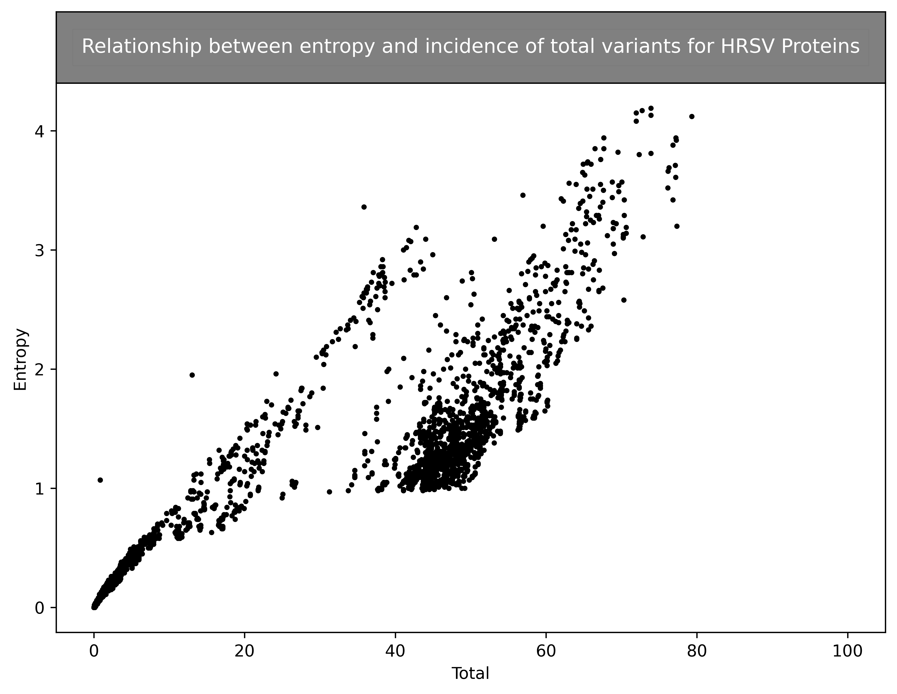
      
      hRSV proteomunun entropy değerleri ve total varyantları arasındaki ilişkiyi gösteren grafik

---------------------------
Dynamics of Diversity Motif
---------------------------

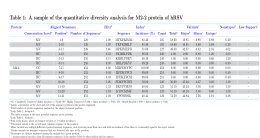
      
      hRSV M2-2 proteininin nicel çeşitlilik analizine ait örnek tablo

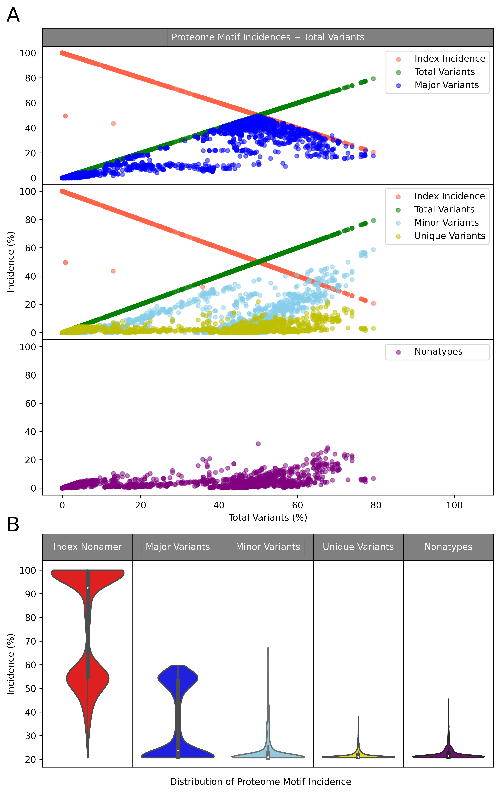
      
      hRSV dizi çeşitliliği motiflerinin proteom düzeyinde dinamiklerini gösteren grafik

.. figure:: ../figures/motifvstotal4all.png
      :alt: hRSV dizi çeşitliliği motiflerinin protein düzeyinde dinamiklerini gösteren grafik
      
      hRSV dizi çeşitliliği motiflerinin protein düzeyinde dinamiklerini gösteren grafik

.. figure:: ../figures/freqdistviolin.png
      :alt: hRSV dizi çeşitliliği motiflerinin dağılımını inceleyen violin grafiği 
      
      hRSV dizi çeşitliliği motiflerinin dağılımını inceleyen violin (keman) grafiği 

------------------------------------------------
Distribution of Conserved and Variable Sequences
------------------------------------------------

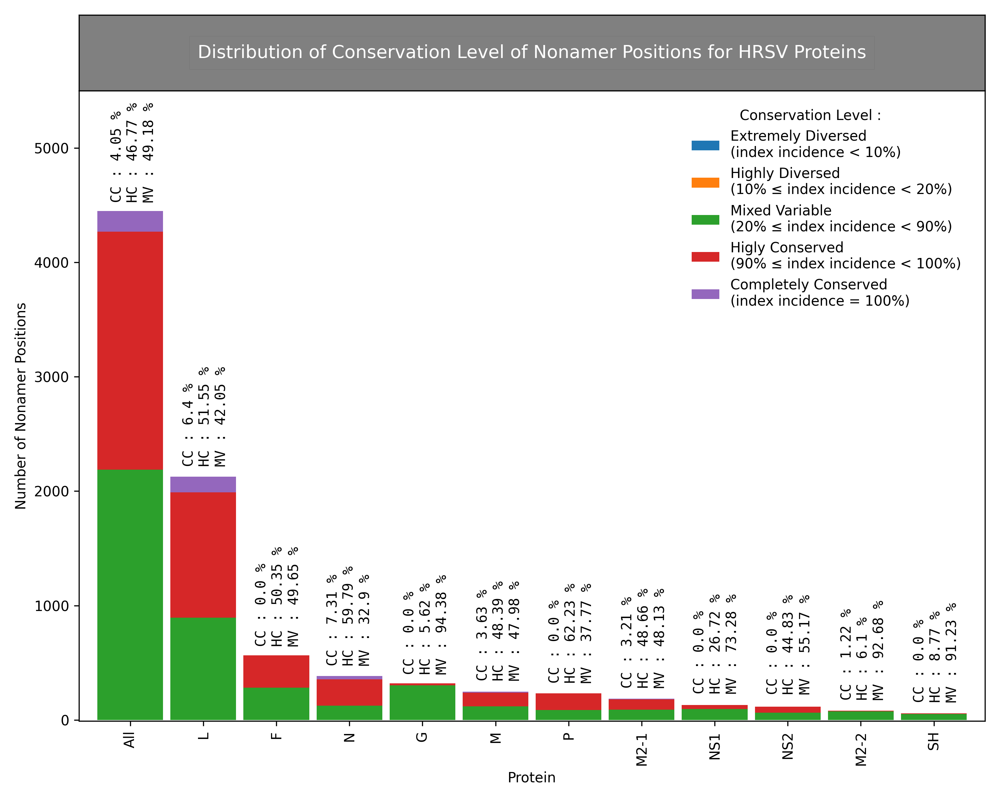
      
      Protein ve proteome düzeyinde hRSV nonamerlerinin korunmuşluk derecelerini gösteren grafik  

----------------------------------------------------
Highly Conserved, Immunogenic Sequences as Potential Vaccine Targets
----------------------------------------------------